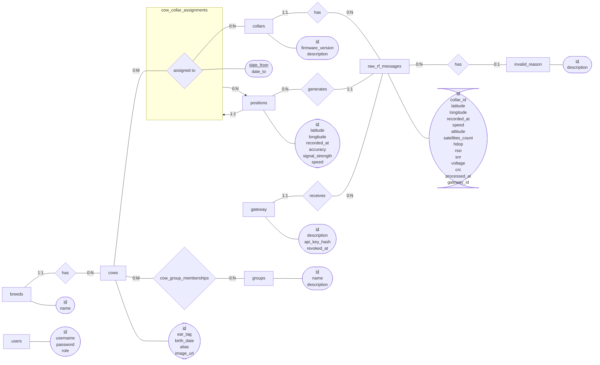

# Modelo conceptual

```mermaid
flowchart LR

    %% ============================================================
    %% ENTIDADES
    %% ============================================================

    BREEDS[breeds]
    COWS[cows]
    COLLARS[collars]
    GROUPS[groups]
    RAW_RF_MESSAGES[raw_rf_messages]
    POSITIONS[positions]
    GATEWAYS[gateway]
    USERS[users]
    INVALID_REASONS[invalid_reason]


    %% ============================================================
    %% RELACIONES
    %% ============================================================

    R_BREED{has}
    R_COW_GROUP{cow_group_memberships}
    R_COLLAR_RAW{has}
    R_RAW_POSITION{generates}
    R_GATEWAY_RAW{receives}
    R_RAW_INVALID{has}


    %% ============================================================
    %% AGREGACIONES
    %% ============================================================

    subgraph ASSIGNMENT_AGG["cow_collar_assignments"]
        R_ASSIGNMENT{assigned to}
    end

    %% ============================================================
    %% ATRIBUTOS
    %% ============================================================

    A_BREEDS(["<u>id</u><br/>name"])

    A_COWS(["<u>id</u><br/>ear_tag<br/>birth_date<br/>alias<br/>image_url"])

    A_COLLARS(["<u>id</u><br/>firmware_version<br/>description"])

    A_ASSIGNMENT(["<u>date_from</u><br/>date_to"])

    A_GROUPS(["<u>id</u><br/>name<br/>description"])

    A_RAW_RF_MESSAGES(["<u>id</u><br/>collar_id<br/>latitude<br/>longitude<br/>recorded_at<br/>speed<br/>altitude<br/>satellites_count<br/>hdop<br/>rssi<br/>snr<br/>voltage<br/>crc<br/>processed_at<br/>gateway_id"])

    A_POSITIONS(["<u>id</u><br/>latitude<br/>longitude<br/>recorded_at<br/>accuracy<br/>signal_strength<br/>speed"])

    A_GATEWAYS(["<u>id</u><br/>description<br/>api_key_hash<br/>revoked_at"])

    A_USERS(["<u>id</u><br/>username<br/>password<br/>role"])

    A_INVALID_REASONS(["<u>id</u><br/>description"])


    %% ============================================================
    %% RELACIONES
    %% ============================================================

    BREEDS ---|1:1| R_BREED
    R_BREED ---|0:N| COWS

    COWS ---|0:M| R_ASSIGNMENT
    R_ASSIGNMENT ---|0:N| COLLARS

    COWS ---|0:M| R_COW_GROUP
    R_COW_GROUP ---|0:N| GROUPS

    COLLARS ---|1:1| R_COLLAR_RAW
    R_COLLAR_RAW ---|0:N| RAW_RF_MESSAGES

    POSITIONS --- |0:N| R_RAW_POSITION
    R_RAW_POSITION --- |1:1| RAW_RF_MESSAGES

    %% Agregación Cow-Collar -> Position
    ASSIGNMENT_AGG -->|0:N| POSITIONS
    POSITIONS -->|1:1| ASSIGNMENT_AGG

    GATEWAYS ---|1:1| R_GATEWAY_RAW
    R_GATEWAY_RAW ---|0:N| RAW_RF_MESSAGES

    RAW_RF_MESSAGES ---|0:N| R_RAW_INVALID
    R_RAW_INVALID ---|0:1| INVALID_REASONS


    %% ============================================================
    %% ATRIBUTOS
    %% ============================================================

    BREEDS --- A_BREEDS
    COWS --- A_COWS
    COLLARS --- A_COLLARS
    R_ASSIGNMENT --- A_ASSIGNMENT
    GROUPS --- A_GROUPS
    RAW_RF_MESSAGES --- A_RAW_RF_MESSAGES
    POSITIONS --- A_POSITIONS
    GATEWAYS --- A_GATEWAYS
    USERS --- A_USERS
    INVALID_REASONS --- A_INVALID_REASONS
```
