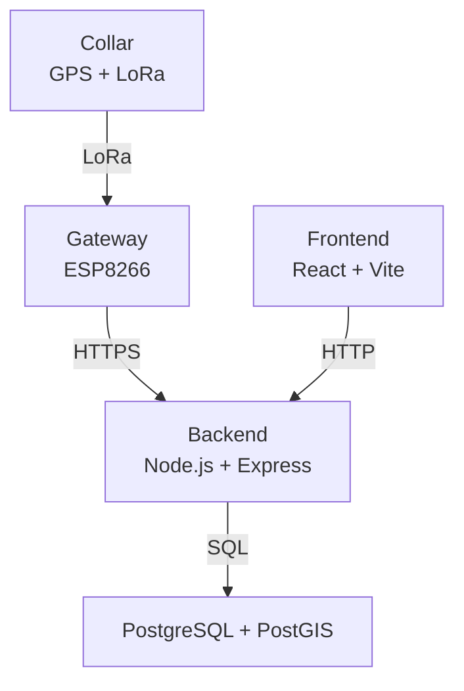
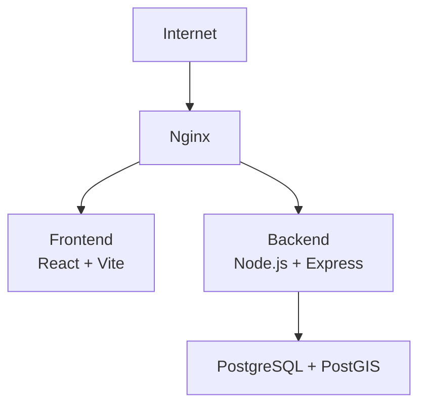

# Arquitectura

## Visión general

La aplicación implementa una arquitectura cliente-servidor compuesta por un
frontend web, un backend encargado de la lógica de negocio y una base de datos
relacional. El sistema se integra además con dispositivos IoT encargados de
capturar y transmitir información de telemetría.

El frontend permite a los usuarios gestionar las entidades del sistema y
consultar la información de seguimiento. El backend expone una API REST y
centraliza la lógica de negocio y el procesamiento de los datos recibidos
desde los dispositivos.

La comunicación entre los distintos componentes se realiza mediante HTTPS,
mientras que los dispositivos de campo utilizan comunicación LoRa para
transmitir los datos hacia los gateways.

## Componentes

### Frontend

Aplicación web desarrollada con:

- React
- Vite
- JavaScript
- React Router
- Map Libre GL para la visualización geográfica
- Lucide para iconografía

El frontend se encarga de la interfaz de usuario, navegación, gestión del
estado de la aplicación y consumo de la API del backend.

### Backend

API REST desarrollada con:

- Node.js
- Express
- Drizzle
- PostgreSQL
- PostGIS para la gestión de datos geoespaciales

El backend concentra la lógica de negocio, validación de datos, autenticación
y autorización, acceso a la base de datos y procesamiento de los datos
recibidos desde los gateways.

El procesamiento de los mensajes recibidos permite transformar los datos
crudos en posiciones utilizables por el sistema.

### Base de datos

Se utiliza PostgreSQL como sistema de gestión de base de datos relacional,
con PostGIS para el manejo de información geográfica.

La base de datos almacena, entre otros datos:

- Vacas
- Razas.
- Collares y asignaciones entre vacas y collares.
- Grupos y pertenencia de vacas a grupos.
- Posiciones.
- Mensajes RF recibidos.
- Gateways.
- Usuarios.

PostGIS permite realizar operaciones espaciales sobre las posiciones
registradas.

### Gateways

Los gateways reciben los mensajes transmitidos por los collares mediante
LoRa y los envían al backend mediante HTTPS.

El gateway está implementado sobre un microcontrolador ESP8266 y utiliza un
módulo LoRa basado en SX1278.

### Collares

Los collares son dispositivos de seguimiento instalados en las vacas.

Cada collar obtiene información de posicionamiento mediante un receptor GPS
y transmite los datos mediante LoRa.

El hardware utilizado incluye:

- ESP8266.
- Módulo LoRa SX1278.
- Receptor GPS NEO-6M.

Los datos transmitidos incluyen información de posicionamiento y parámetros
relacionados con la calidad de la señal y el estado del dispositivo.

## Comunicación entre componentes

La comunicación entre los componentes principales se realiza de la siguiente
manera:

## Flujo de datos

El flujo principal de información de seguimiento es:

1. El collar obtiene su posición mediante GPS.
2. El collar transmite la información mediante LoRa.
3. El gateway recibe el mensaje LoRa.
4. El gateway envía el mensaje al backend mediante HTTPS.
5. El backend almacena el mensaje recibido como dato crudo.
6. Un proceso del backend analiza y transforma los mensajes pendientes.
7. Se genera una posición a partir de los datos procesados.
8. La posición se almacena en PostgreSQL/PostGIS.
9. El frontend consulta la información mediante la API.
10. El usuario puede visualizar las posiciones y el seguimiento de las vacas.

## Despliegue

La aplicación se despliega sobre una instancia EC2 de AWS.

Nginx funciona como punto de entrada al sistema y como reverse proxy. Se
encarga de servir los archivos estáticos generados por el frontend y de
redirigir las solicitudes dirigidas a la API hacia el backend.

El backend se ejecuta como una aplicación Node.js administrada mediante PM2.
La base de datos PostgreSQL con PostGIS se ejecuta en la misma infraestructura.

El esquema general de despliegue es:

