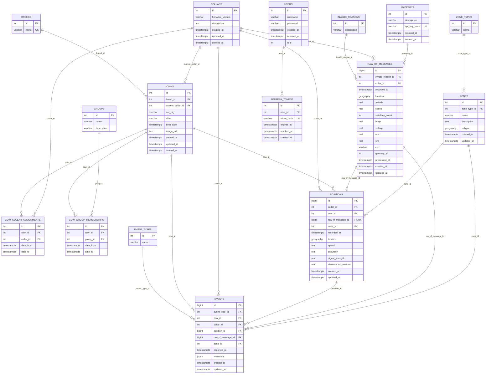

# Modelo relacional

El siguiente diagrama representa el modelo físico de datos implementado en una base de datos relacional. Se detallan las principales entidades del sistema, sus atributos y las relaciones establecidas mediante claves primarias y foráneas.

> **Nota:** Las entidades Zonas y Eventos se encuentran fuera del alcance de esta entrega.
